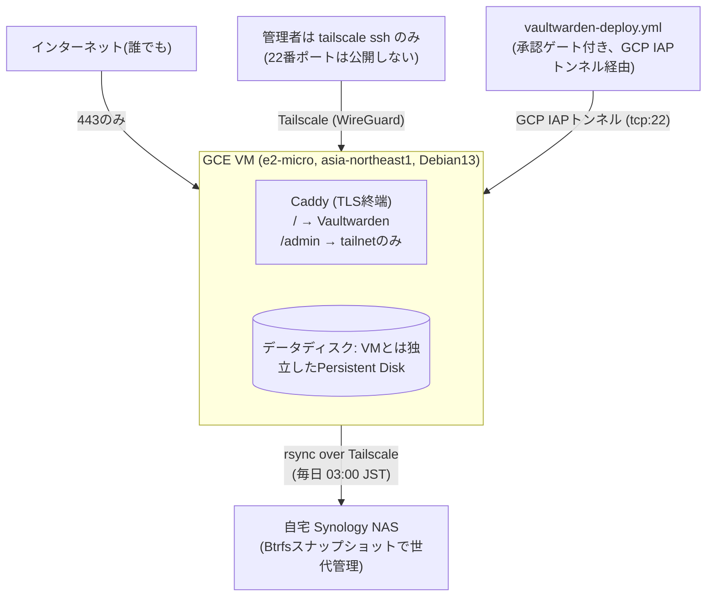

# はじめに

家族で使うパスワードマネージャーとして [Vaultwarden](https://github.com/dani-garcia/vaultwarden)(Bitwarden互換のOSSサーバー実装)をGCP上にセルフホストしています。この記事では、その運用基盤をTerraform + GitHub Actions + Tailscaleでどう組んだかを紹介します。

個人利用とはいえ「マスターパスワードの入り口」を預かるシステムなので、以下を最低限のラインとして設計しました。

- 管理画面や22番ポートをパブリックインターネットに晒さない
- バージョンアップは自動反映せず、人間の承認を挟む
- インフラの変更もPull Requestとレビューを経る(自分しかいなくても)
- バックアップは自宅NASへ、世代管理付きで

リポジトリはパブリックです: https://github.com/kuchida1981/vaultwarden-ops

# そもそも Vaultwarden とは？

[Vaultwarden](https://github.com/dani-garcia/vaultwarden) は、広く使われているパスワードマネージャー「Bitwarden」のオープンソース互換サーバー実装です（旧称: `bitwarden_rs`）。

## なぜ公式BitwardenではなくVaultwardenなのか？
公式のBitwardenサーバーもオープンソースですが、**ASP.NET Core + MSSQL** など複数の重厚なコンポーネントで構成されており、自前でホストするには最低でも数GBのRAMと多数のDockerコンテナが必要になります。個人や少人数向けにはややオーバースペックです。

一方の Vaultwarden は **Rust** でフルスクラッチで再実装されており、以下の特徴があります：

- **極めて軽量**: 単一バイナリ / 単一コンテナで動作し、DBも標準で SQLite を利用可能。メモリ消費量は数十MB程度に収まるため、GCEの `e2-micro` (1GB RAM) や Raspberry Pi のような極小リソースでも余裕で軽快に動く
- **公式クライアントがそのまま使える**: ブラウザ拡張機能、iOS / Android アプリ、デスクトップアプリ、CLI など、公式の Bitwarden クライアントの「サーバーURL」を自分のホストに向けるだけで完全にそのまま利用可能
- **プレミアム機能が利用可能**: 家族やチーム間でのパスワード共有（Organizations）やTOTP二要素認証コードの生成、添付ファイル保存など、公式SaaSでは有料プラン相当の機能も標準で使える

この「**公式クライアントの使い勝手と安全性を享受しつつ、月額数十円〜数百円のミニマムなクラウドリソースで運用できる**」点が、セルフホスティングにおいて絶大な支持を集めている理由です。

# 全体構成



構成要素はシンプルです。

- **GCE e2-micro 1台**(東京リージョン)に Caddy + Vaultwarden を Docker Compose で同居させる
- 公開しているのは443番ポートだけ。22番はパブリックインターネットからのアクセスをファイアウォールで塞ぎ、運用アクセスは**Tailscale経由の `tailscale ssh` のみ**
- `/admin` パネルは公開ドメインからは常に403を返し、`tailscale serve` でtailnet内だけに別途公開
- CI/CDからのSSHだけは例外で、GCPのIAPトンネル経由で承認ゲート付きの自動化に許可している
- データはVM本体とライフサイクルを分離した専用Persistent Diskに置き、毎日自宅Synology NASへrsyncでバックアップ

この「人間は完全にTailscale経由、CIだけはIAP経由で特別扱い」という非対称な設計が今回のポイントの一つです。

# 気になるランニングコスト

個人や家族で運用する上で最も気になるコストですが、構成パターンによって以下のようになります。

1. **現在の構成（東京リージョン `asia-northeast1`）: 約2,000円弱/月**
   - 内訳は GCE `e2-micro` インスタンス代 + 静的外部IP + 永続ディスク（20GBブート + 10GBデータディスク）です。
   - レイテンシと日本国内完結を優先して東京リージョンを選んでいますが、それでもBitwarden公式のファミリープラン（$40/年）やビジネス向けSaaSと比べて十分リーズナブルです。
2. **USリージョンで1台目のVMとして動かす場合: ほぼ0円〜数十円/月**
   - GCPには [Always Free枠](https://cloud.google.com/free) があり、米国の対象リージョン（`us-central1` など）であれば `e2-micro` 1台と標準永続ディスク合計30GBまでが**無料枠**に収まります。
3. **完全 Tailnet 閉域で動かす場合: ほぼ完全に0円 ＆ 最もセキュア**
   - 「家族や社員全員の端末にTailscaleが入っている」前提であれば、インターネット向け443番ポートの公開（静的外部IP）すら不要になり、Vaultへのアクセス自体もTailnet内に閉じることができます。
   - この場合、外部IP課金も発生せず**完全にタダ**で運用可能になり、何より「パスワードマネージャーがインターネット上から一切見えない（ポートスキャンすらされない）」という最強のセキュリティが手に入ります。

# Terraformをbootstrapとmainの2段に分けた理由

`terraform/`配下は `bootstrap` と `main` の2ディレクトリに分かれています。

- `terraform/bootstrap`: **手動apply、一度きり**。GCSのstateバケット、GitHub Actions用のWorkload Identity Federation(WIF)プール、Terraform実行用のCIサービスアカウントそのものを作る
- `terraform/main`: **GitHub Actionsが継続的にapply**。VM、ファイアウォール、ディスク、Secret Manager、Tailscale ACL/認証キーなど実際のインフラ

なぜ分けるかというと、「CIサービスアカウント自身の権限を、そのCIサービスアカウント自身に管理させない」ためです。もし `bootstrap` もCIでapplyしてしまうと、CIの実行主体が自分自身に権限を追加できてしまい、権限昇格の温床になります。そのため `bootstrap` は意図的にCI化せず、`terraform-plan.yml` でPRごとに `terraform plan` の結果だけコメントし、実際の `apply` は人間がローカルで叩く運用にしています。

一方 `main` はDependabotが週次でプロバイダのバージョンを上げるPRを送ってくるので、`terraform-plan.yml` → レビュー → mainマージ → `terraform-apply.yml` が起動し、GitHub Environmentの`production`承認ゲートで一時停止 → 承認、という流れを自動化しています。ちなみにDependabotのPRで、メジャーバージョン更新でなく、かつ `terraform plan` の差分がゼロの場合は**自動マージ**される仕組みも入れています。「何でも人間の目を通す」のではなく、「差分がないことが機械的に証明できるものは自動化する」というバランスです。

# Vaultwardenのバージョンアップも「マージ」と「デプロイ」を分離

Vaultwardenのイメージタグは `vaultwarden/docker-compose.yml` に固定値で書いてあり、Dependabotが新バージョンを検知するとPRを出してくれます。ここでのポイントは、**PRをマージしただけでは本番に何も反映されない**という設計です。

1. **バージョンを受け入れる**: PRをレビューしてmainにマージ(この時点でVM側は無変更)
2. **今デプロイする**: マージをトリガに `vaultwarden-deploy.yml` が起動し、`production` Environmentの承認待ちで一時停止。承認すると、CIランナーがGCP IAPトンネル経由でVMにSSHし、リポジトリの `git pull --ff-only` → `docker compose pull` → Caddyを `--force-recreate` で再作成 → Vaultwardenを `up -d` で更新、という2段階のデプロイを実行

Caddyだけ `--force-recreate` するのは、Caddyfileがbind-mountされているため、`git pull` でinode番号が変わると既存コンテナ内のマウントが古いファイルを掴み続けてしまうからです。TLS証明書やconfigはDocker named volumeに保持されているのでコンテナ再作成で失われることはなく、Vaultwardenコンテナはイメージに変更がある場合だけ再作成されます。

「マージ」と「本番反映」を明確に分けることで、深夜にDependabotのPRを機械的にマージしても勝手に本番が更新されることはなく、実際のロールアウトタイミングは常に自分の意思で選べます。

# Tailscaleでネットワーク境界を作る

このリポジトリでのTailscaleの使い所は3つあります。

1. **運用SSHの唯一の経路**: 22番ポートはGCPファイアウォールで公開せず、`tailscale ssh` だけを許可
2. **管理画面の隔離公開**: `/admin` は `tailscale serve` でtailnet内のMagicDNSホスト名(`https://vaultwarden.<tailnet名>.ts.net/admin`)にのみ公開し、パブリックドメイン経由では常に403
3. **NASバックアップの転送経路**: VMから自宅NASへのrsyncも同じtailnet内で完結させ、インターネットに一切出さない

ACLやTailscale側の認証キー発行も `terraform/main/tailscale.tf` でTerraform管理下に置いているので、「誰が admin タグを持てるか」も含めてコードでレビューできます。なお、自分は別途 n8n (ワークフロー自動化ツール) もセルフホストしていますが、Tailscale ACLは**このリポジトリを唯一の所有者として一元管理**し、`tag:n8n-server` も含めて定義しています。複数リポジトリからACLを部分更新するとリソースの上書き合戦になるため、「ACLの真実は1箇所だけ」というルールにしています。

# バックアップ: Btrfsスナップショットに世代管理を丸投げする

Vaultwarden側のバックアップスクリプトは、DBのconsistentなスナップショット(`sqlite3 .backup`)・添付ファイル・Send・署名鍵・設定ファイルをまとめて、毎日Tailscale経由でSynology NASのrsyncデーモンへpushします。

工夫したのは、**世代管理(何日分残すか)をVM側では一切持たず、NAS側のBtrfsスナップショット機能に丸投げした**点です。rsyncは常に「最新の状態を上書きする」だけのシンプルな役割に留め、7日分・4週分・3ヶ月分といった世代管理はNASのSmart Retentionルールに任せています。認証もrsyncdのパスワードのみで、SSH鍵ペアの管理をしていません。これは通信がTailscaleのWireGuardトンネル内に閉じているため許容している判断で、`openspec/changes/archive/2026-07-12-add-nas-backup/design.md` に判断理由を残しています。

# OpenSpecでインフラ変更もスペック駆動にした

このリポジトリは実装をすべて[Claude Code](https://claude.com/claude-code)と一緒に進めていますが、単に「変更を頼んで終わり」にはせず、[OpenSpec](https://github.com/Fission-AI/OpenSpec)というスペック駆動開発のワークフローに乗せています。`openspec/changes/archive/` を見ると、これまでの変更が全部proposal(なぜやるか・設計・タスク一覧)として残っていることが分かります。

```
2026-07-07-add-vaultwarden-hosting
2026-07-08-add-smtp-support
2026-07-12-add-nas-backup
2026-07-12-hash-admin-token
2026-07-12-route-admin-via-tailscale-serve
2026-07-24-enable-bootstrap-ci-plan
2026-07-24-migrate-bootstrap-state-to-gcs
2026-07-29-add-vaultwarden-deploy-pipeline
2026-08-02-disable-email-duo-2fa
2026-08-04-fix-vaultwarden-ip-header
```

一人で回している個人インフラであっても、「なぜこの設計にしたか」をproposalとして先に固め、実装後にspecへアーカイブする、というサイクルを踏むことで、数ヶ月後の自分が読んでも意思決定の背景が追える状態を維持できています。実際、上記のような小粒な変更(管理者トークンのハッシュ化、admin導線をTailscale serve経由に変更、IPヘッダの修正など)も、思いつきで直接VMを触るのではなく、必ずこのサイクルを通しています。

# 小規模チーム・中小企業にも使える構成だと思う

ここまで「家族用」として紹介してきましたが、この構成は**10〜50人規模の小規模オフィスや中小企業にもそのままフィットする**と考えています。理由をいくつか挙げます。

- **コスト**: GCE e2-microは[Always Free枠](https://cloud.google.com/free)に収まる可能性があり、仮に課金されてもBitwarden Teams($4/ユーザー/月)と比べて桁違いに安い。Tailscaleも100台までは無料プラン
- **データ主権**: パスワードという最も機密性の高いデータを外部SaaSに預けず、自社GCPプロジェクト内に閉じられる。業種によってはこれが規制対応上の要件になることもある
- **ゼロトラストネットワーク**: Tailscaleを入れるだけで、VPN装置の購入・運用なしにゼロトラスト的な管理アクセスが手に入る。社員の端末にTailscaleクライアントを入れれば、リモートワークでもオフィスでも同じ導線で管理画面にアクセスできる
- **監査可能性**: インフラ変更はすべてPull Requestとして記録され、「いつ・誰が・何を変えたか」がGit履歴に残る。ISO 27001等の監査でも変更管理の証跡として使える
- **属人化の防止**: OpenSpecに設計判断が残っているので、担当者が退職しても「なぜこう作ったか」が追える

もちろん、**単一VMなのでHAではない**点は注意が必要です。ただしVaultwardenが落ちても、各端末のBitwardenクライアントはローカルにキャッシュを持っているため即座に業務が止まるわけではなく、バックアップから復旧するまでの時間が許容範囲内であれば実用上は十分だと考えています。本格的な可用性が必要なら、Cloud SQLへの移行やリージョン冗長化を検討することになりますが、それはこの構成の「次のステップ」として自然な拡張です。

# まとめ

- 家族用の小さなVaultwardenサーバーでも、「公開領域は最小限」「人間の承認を挟む」「変更はレビュー可能な形で残す」という原則は個人開発でも十分効果がある
- Terraformのbootstrap/main分離は、CI用サービスアカウントに自己権限昇格をさせないための設計として汎用的に使える
- Tailscaleを「管理アクセスの唯一の入口」として扱うと、パブリックな攻撃対象を大きく減らせる
- インフラの意思決定もOpenSpec + Claude Codeでスペック駆動にしておくと、後から読み返せる資産になる
- この構成は家族用に限らず、小規模オフィスや中小企業でも「SaaSに預けたくない」「低コストで運用したい」というニーズに応えられるポテンシャルがある

まだ「マスターパスワードを完全に忘れた場合の復旧手段(Organization Account Recovery / Emergency Access)」など未対応の部分もあり、Roadmapとして残しています。興味があればリポジトリも覗いてみてください。

https://github.com/kuchida1981/vaultwarden-ops
